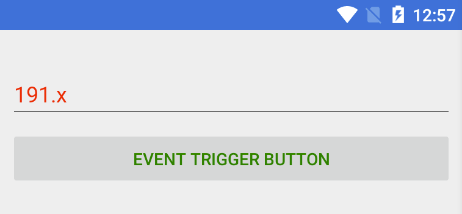

### Style Trigger

สามารถเพิ่ม Trigger ใน Xaml โดยไม่จำเป็นต้องแก้ไขโค้ด `C#`

- StyleTriggerExampmle.xaml

```xml
<?xml version="1.0" encoding="UTF-8"?>
<ContentPage
        xmlns="http://xamarin.com/schemas/2014/forms"
        xmlns:x="http://schemas.microsoft.com/winfx/2009/xaml"
        x:Class="Behavior.StyleTriggerExample">
    <ContentPage.Content>
        <StackLayout Padding="20,40,20,20">
            <Entry Placeholder="Enter your name" TextColor="Maroon" Opacity="0.5">
               <Entry.Style>
                 <Style TargetType="Entry">
                  <Style.Triggers>
                    <Trigger Property="Entry.IsFocused" Value="True" TargetType="Entry">
                      <Setter Property="Entry.Opacity" Value="1.0" />
                      <Setter Property="Entry.TextColor" Value="Red" />
                      <Setter Property="Entry.FontSize" Value="25"/>
                    </Trigger>
                   </Style.Triggers>
                 </Style>
               </Entry.Style>
            </Entry>
        </StackLayout>
    </ContentPage.Content>
</ContentPage>
```

### Event Trigger

ประกาศ Trigger Handler ไว้ในไฟล์ `C#` สามารถเรียกใช้โดยเพิ่ม namespace `xmlns:local="clr-namespace:Behavior; assembly=Behavior"` ใน Xaml

- ButtonTriggerExample.xaml

```xml
<ContentPage
        xmlns="http://xamarin.com/schemas/2014/forms"
        xmlns:x="http://schemas.microsoft.com/winfx/2009/xaml"  
        xmlns:local="clr-namespace:Behavior; assembly=Behavior"
        x:Class="Behavior.ButtonTriggerExample">
    <ContentPage.Content>
        <StackLayout Padding="10,30,10,10">
            <Entry Placeholder="Enter a System.Double">
                <Entry.Triggers>
                    <EventTrigger Event="TextChanged">
                        <local:NumericValidationTriggerAction />
                    </EventTrigger>
                </Entry.Triggers>
            </Entry>

            <Button Text="Event Trigger Button">
                <Button.Triggers>
                    <EventTrigger Event="Clicked">
                        <local:ButtonTrigger/>
                    </EventTrigger>
                </Button.Triggers>
            </Button>
        </StackLayout>
    </ContentPage.Content>
</ContentPage>
```

- Triggers.cs

```csharp
namespace Behavior {
    public class NumericValidationTriggerAction : TriggerAction<Entry> {
        protected override void Invoke (Entry entry) {
            double result;
            bool isValid = Double.TryParse (entry.Text, out result);
            entry.TextColor = isValid ? Color.Default : Color.Red;
        }
    }

    public class ButtonTrigger: TriggerAction<Button> {
        protected override void Invoke (Button sender) {
            sender.TextColor = sender.TextColor == Color.Green ? Color.Red : Color.Green;
        }
    }

    public class ImageTrigger : TriggerAction<Image> {
        protected override void Invoke (Image sender) {
            sender.Opacity = .5;
        }
    }
}

```


#### Reference

- https://developer.xamarin.com/guides/xamarin-forms/working-with/triggers
